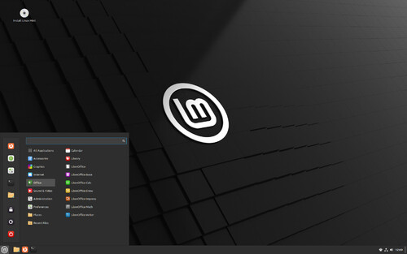
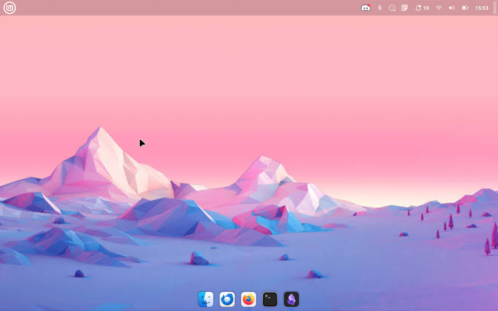

# 🎨 Project Lazarus: Visual Transformation & Interface Design

A desktop environment is about more than just looking pretty—it defines how comfortably you can work. Since I dug this 2012 MacBook out of the closet to handle my daily on-the-go productivity tasks, I wanted an interface that felt cohesive, sleek, and natural on original Apple hardware.

By leveraging the Linux Mint Cinnamon desktop engine, I stripped away the traditional Windows-style taskbar and completely rebuilt the layout to capture the premium, minimalist aesthetic of classic macOS.

---

## 📸 The Transformation (Before & After)

To give you an immediate look at what clean open-source themes can do, here is the complete visual shift from a stock Linux Mint layout to the fully customized "Project Lazarus" workspace:

### 🔄 The Starting Point (Stock Linux Mint)
When you first install Linux Mint, it defaults to a traditional PC layout. It features a heavy, dark taskbar at the bottom of the screen, application tabs cluttering the panel, and window control buttons sitting on the far right. 
<!-- PLACE YOUR BEFORE SCREENSHOT HERE -->


### 🍏 The End Result (Project Lazarus Workspace)
After injecting the customized configuration files, the workspace completely transforms. The screen features a transparent, frosted-glass menu bar shifted to the very top, a responsive floating application dock sitting at the baseline with smooth icon-zooming effects, and high-definition Apple-style iconography.
<!-- PLACE YOUR AFTER SCREENSHOT HERE -->


---

## 🛠️ Step-by-Step UI Architecture

If you want to replicate this exact setup on your own machine, here is the design blueprint I used to map out the interface:

### 1. Panel Layout & Spatial Real Estate
*   **The Top Menu Bar:** I right-clicked the stock bottom panel, accessed **Panel Settings**, used the **Move Panel** tool, and locked it to the top margin of the screen to mimic Apple’s system menu layout.
*   **Cleaning the Taskbar Clutter:** To stop windows from populating on the top bar, I toggled **Panel Edit Mode**, right-clicked the active application tracker tabs, and selected **Remove 'Window List'**. 
*   **The Bottom App Dock:** I installed `plank`, a hardware-accelerated desktop dock, and set it to load automatically at system boot via the **Startup Applications** tool. 
    *   *The Zoom Tweak:* By holding `Ctrl` and right-clicking the dock, I entered its preferences and toggled **Icon Zooming** ON to get that smooth Apple magnification response on hover.

### 2. Window Ergonomics
To train my muscle memory correctly on original Apple hardware, I shifted the window close, minimize, and maximize buttons back to where they naturally belong. 
*   Navigated to **System Settings -> Windows -> Titlebar**.
*   Switched the **Buttons layout** dropdown from **Right** to **Left**.

### 3. Applying the Premium WhiteSur Theme Framework
To wrap everything together, I deployed the community-favorite `WhiteSur` design asset tree. This converts the system folder structures into Apple's signature blue contours and turns standard window borders into smooth, dark slate panels.

I automated the file downloads and folder placements cleanly via the terminal:
```bash
mkdir -p ~/.icons && cd ~/.icons
curl -L -o whitesur-icons.tar.xz https://github.com
tar -xf whitesur-icons.tar.xz
mv WhiteSur-icon-theme-2024-05-01/src/* ./
rm -rf WhiteSur-icon-theme-2024-05-01 whitesur-icons.tar.xz
```

Finally, I opened **System Settings -> Themes** and toggled every single display category (Window borders, Icons, Controls, and Desktop) over to **WhiteSur-dark** to lock in a seamless system-wide Dark Mode.

---

## 🌌 The Final Polish: Sleek & Modern Wallpapers
To make the frosted glass panels pop, the desktop environment is paired with a moody, dark abstract vector wallpaper. This setup keeps the workspace feeling clean and focused during late-night research or coding sprints in Obsidian.
